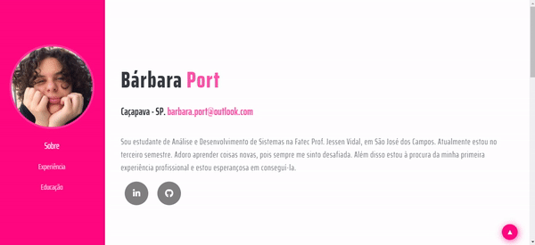

<html>
  <body>
    
<h1>Portfólio Simples :smile:</h1>

    
Este pequeno projeto é uma <i>landing page</i> contendo as principais informações sobre mim, de forma que eu aprenda mais HTML, CSS e JavaScript.

    
Página feita a partir de um <a href="https://www.youtube.com/watch?v=V-uFal1XTVw">tutorial do YouTube</a>.

    <h2>Resultado final :sparkles:</h2>
    
  </body>
</html>